

## Screenshots

#### Add user via email
<!-- 

<kbd></kbd>&nbsp;&nbsp;&nbsp;&nbsp;&nbsp;&nbsp;<kbd></kbd>

 
 -->
| (1) | (2) |
| ------------------ | ------------------ |
| 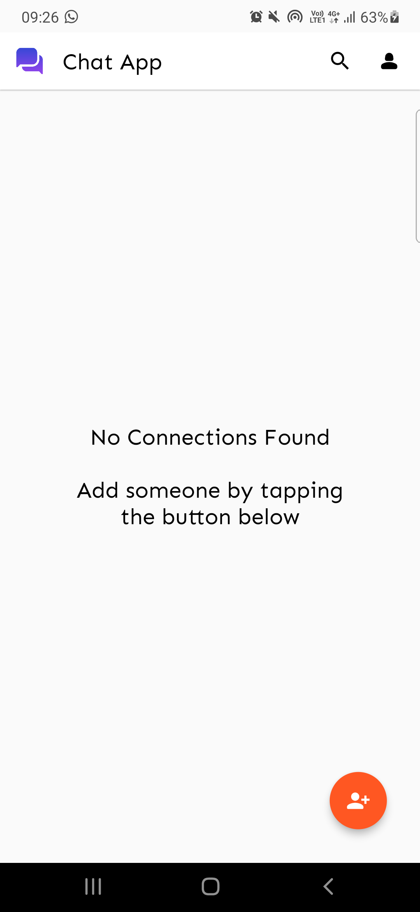  | 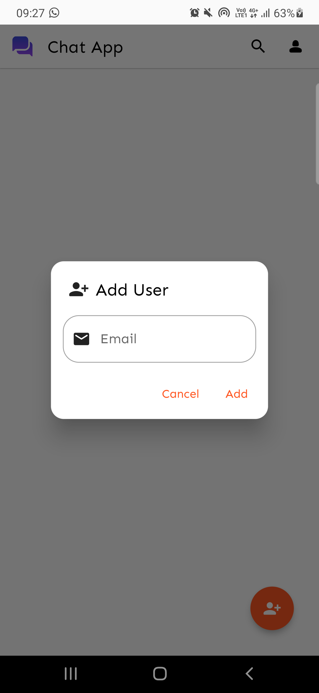  |

#### Edit profile

<!-- 

<kbd></kbd>&nbsp;&nbsp;&nbsp;&nbsp;&nbsp;&nbsp;<kbd></kbd>&nbsp;&nbsp;&nbsp;&nbsp;&nbsp;&nbsp;<kbd></kbd>

 -->

| (1) | (2) | (3) |
| ------------------ | ------------------ | ------------------ |
| 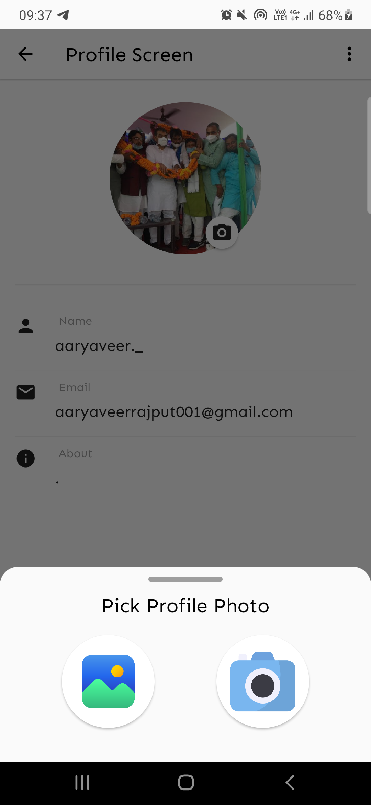  | 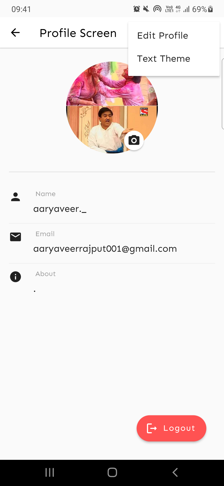  | 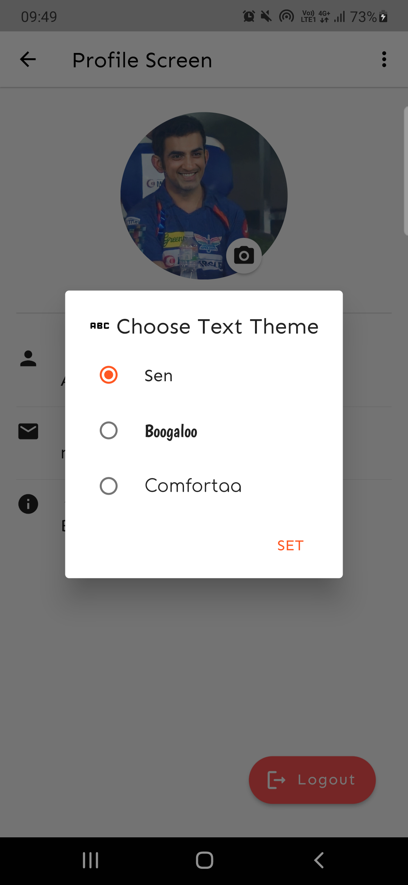  |

#### Chat Feature
<!-- 

<kbd></kbd>&nbsp;&nbsp;&nbsp;&nbsp;&nbsp;&nbsp;<kbd></kbd>&nbsp;&nbsp;&nbsp;&nbsp;&nbsp;&nbsp;<kbd></kbd>

  -->

| (1) | (2) | (3) |
| ------------------ | ------------------ | ------------------ |
| 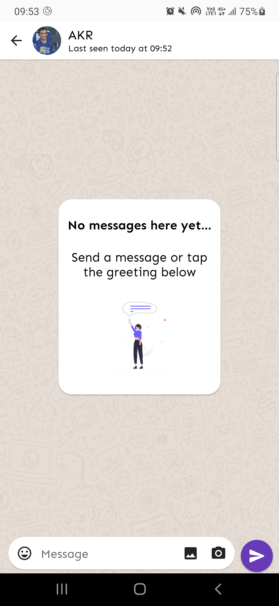  | 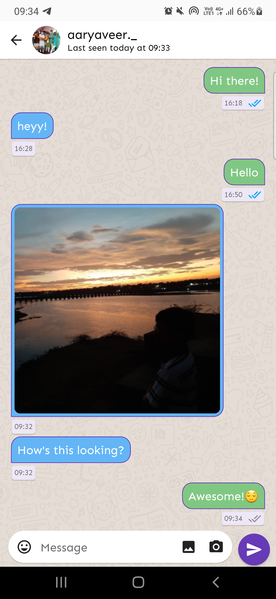  | 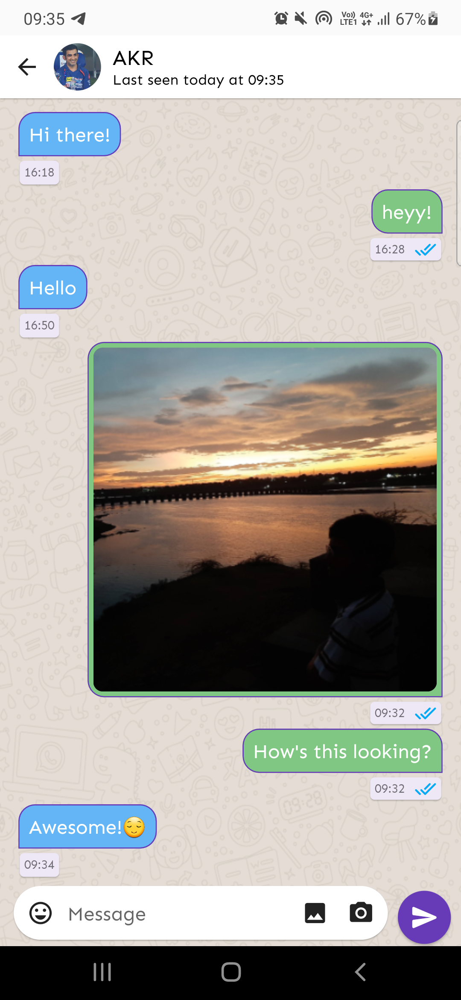  |

#### Message Info

Sent messages

<!-- 

<kbd></kbd>&nbsp;&nbsp;&nbsp;&nbsp;&nbsp;&nbsp;<kbd></kbd>&nbsp;&nbsp;&nbsp;&nbsp;&nbsp;&nbsp;

 -->

| (1) | (2) |
| ------------------ | ------------------ |
| 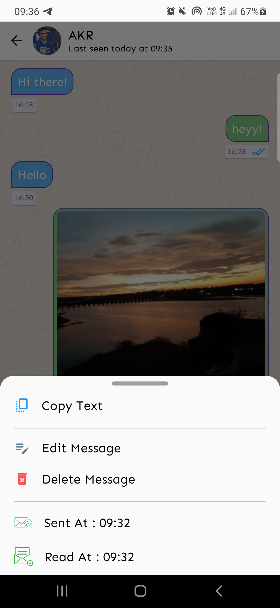  | 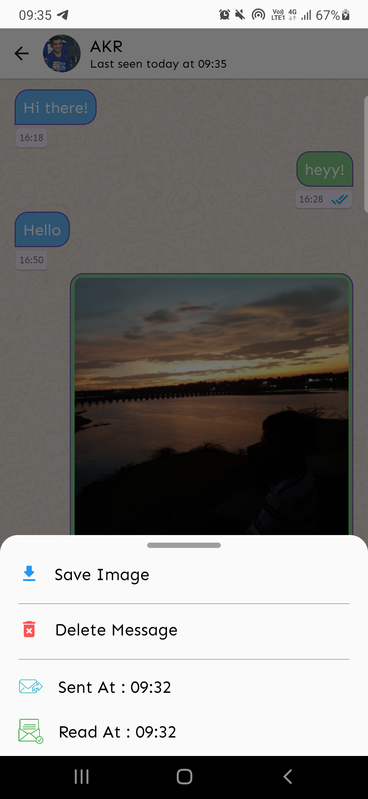  |

Received Messages

<!-- 

<kbd></kbd>&nbsp;&nbsp;&nbsp;&nbsp;&nbsp;&nbsp;<kbd></kbd>

 -->

| (1) | (2) |
| ------------------ | ------------------ |
| 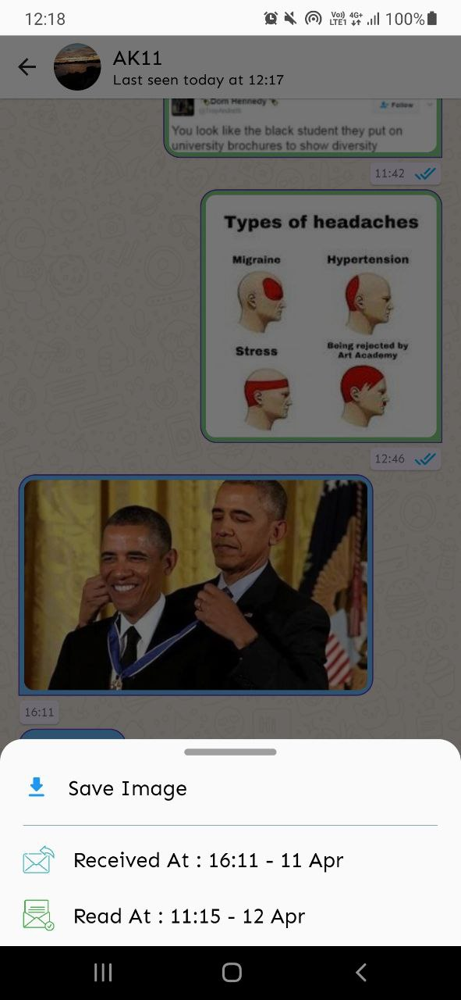  | 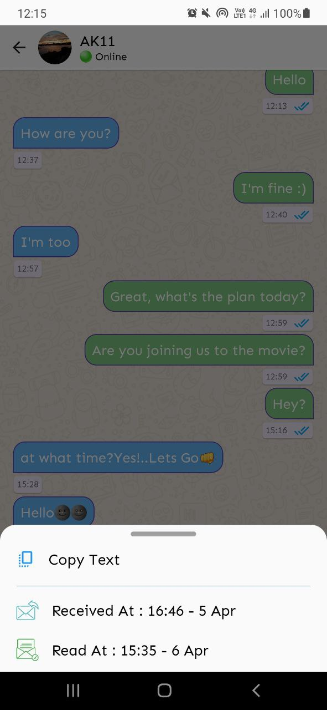  |

#### Chat Media
<!-- 

<kbd></kbd>&nbsp;&nbsp;&nbsp;&nbsp;&nbsp;&nbsp;<kbd></kbd>&nbsp;&nbsp;&nbsp;&nbsp;&nbsp;&nbsp;<kbd></kbd>

  -->

| (1) | (2) | (3) |
| ------------------ | ------------------ | ------------------ |
| 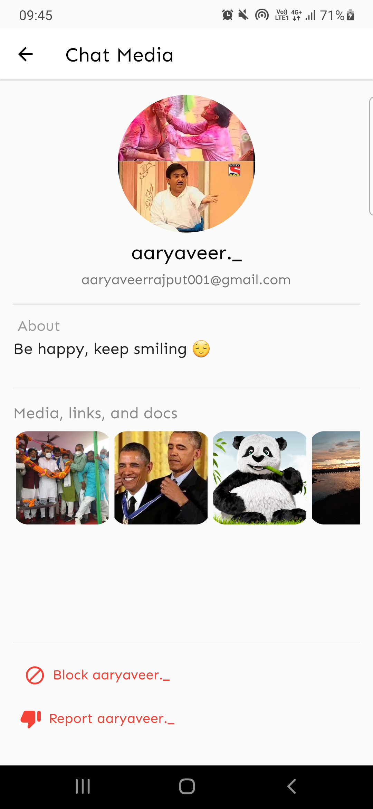  |   |   |

#### Search | View Profile Picture
<!-- 

<kbd></kbd>&nbsp;&nbsp;&nbsp;&nbsp;&nbsp;&nbsp;<kbd></kbd>&nbsp;&nbsp;&nbsp;&nbsp;&nbsp;&nbsp;<kbd></kbd>

  -->

| (1) | (2) | (3) |
| ------------------ | ------------------ | ------------------ |
| 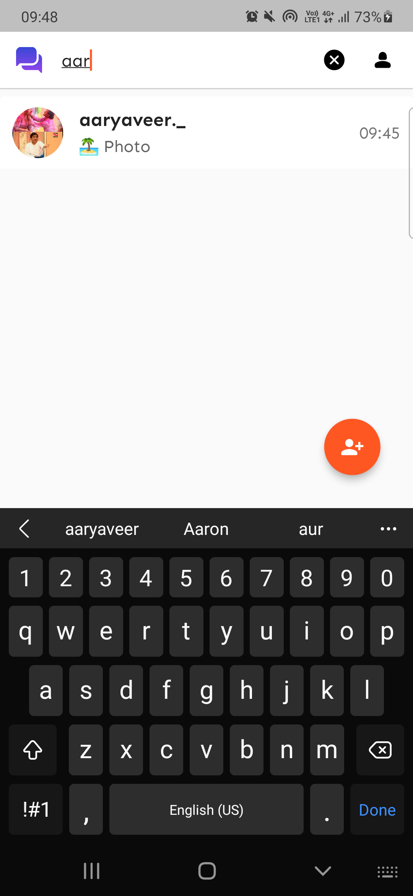  | 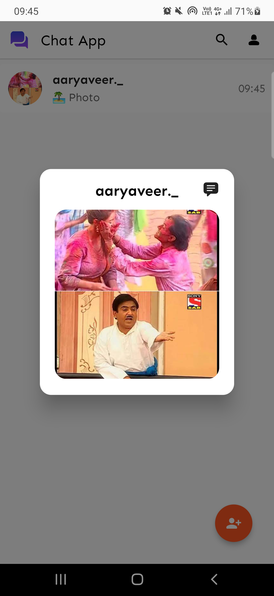  |   |

#### Home Page
<!-- 

<kbd></kbd>

 -->

| (1) |
| ------------------ | 
| 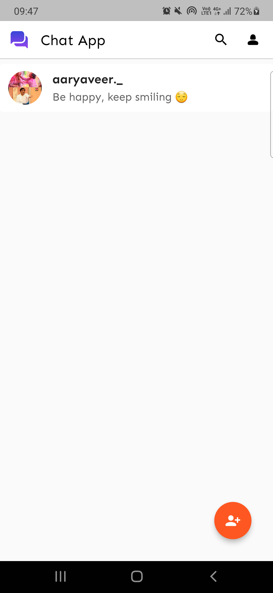 | 
___
##### I hope this repository will be helpful to flutter developers. Feel free to reach out to me in case you have any queries or feedback.

